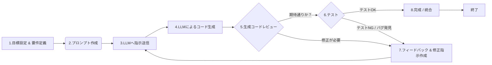

# LLM (大規模言語モデル) を使ってプログラミングを効果的に指示するためのテクニック

LLM (大規模言語モデル) を使ってプログラミングを効果的に指示するためのテクニックは多岐にわたります。

**1. 指示（プロンプト）の基本原則**

- **明確性 (Clarity):**
  - **目的を明確にする:** 何を作りたいのか、何を達成したいのかを具体的に記述します。「ユーザー認証機能を作って」ではなく、「メールアドレスとパスワードでユーザー登録・ログインできるPython FlaskのAPIエンドポイントを作って。パスワードはハッシュ化して保存すること」のように具体的にします。
  - **曖昧な表現を避ける:** 「いい感じに」「うまく」といった主観的・曖昧な表現は避け、具体的な要件を伝えます。
- **具体性 (Specificity):**
  - **使用言語・ライブラリ・フレームワークを指定する:** 「Pythonで」「Reactを使って」「TensorFlowのKeras APIで」など、技術スタックを明示します。バージョン指定が必要な場合も記述します（例: Python 3.9, React 18）。
  - **入力と出力を定義する:** 関数の場合、引数（型、名前、意味）と戻り値（型、形式、内容）を明確に指定します。APIならリクエスト形式（メソッド、パス、ヘッダー、ボディ）とレスポンス形式（ステータスコード、ヘッダー、ボディ）を定義します。
  - **処理ステップを記述する:** 複雑な処理の場合、期待する処理の流れをステップバイステップで記述すると、LLMが理解しやすくなります。
- **文脈 (Context) の提供:**
  - **関連する既存コードを提供する:** 既存のコードに追加・修正する場合、関連する部分のコードスニペットを提供します。長すぎる場合は、重要な部分やインターフェース定義を抜粋します。
  - **前提条件・制約条件を伝える:** 「特定のDBスキーマを使う」「外部APIの仕様」「パフォーマンス要件（例: 1秒以内に応答）」「コーディング規約」などを伝えます。
  - **データ構造を説明する:** 扱うデータの形式（JSONスキーマ、クラス定義、DBテーブル定義など）を提供します。
- **簡潔性 (Conciseness):**
  - **不要な情報を削る:** 指示に関係のない情報は混乱を招く可能性があるため、必要最低限の情報に絞ります。ただし、必要な文脈は省略しないように注意します。

**2. 効果的なプロンプトの構成要素**

- **役割を与える (Assign a Role):**
  - 「あなたは経験豊富な[言語名]開発者です。」「あなたはセキュリティ専門家としてレビューしてください。」のように役割を与えることで、その役割に沿った質の高い回答が期待できます。
- **例を示す (Provide Examples / Few-shot Prompting):**
  - **入出力例:** 「入力が `[1, 2, 3]` なら出力は `6` になる関数」「こういうJSONを受け取ったら、こういうJSONを返すAPI」のように具体的な例を示します。
  - **望ましいコードスタイル例:** 特定のフォーマットや命名規則を期待する場合、短いコード例を示します。
- **出力形式を指定する (Specify Output Format):**
  - 「関数定義だけ書いて」「クラス全体を記述して」「Markdownのコードブロックで出力して」「JSON形式で設定を出力して」のように、期待する出力の形式を指定します。
  - **説明やコメントの要否:** 「コードだけでなく、各部分の簡単な説明も加えてください」「詳細なコメントは不要です」など。
- **思考プロセスを促す (Chain-of-Thought / Step-by-Step):**
  - 複雑な問題の場合、「ステップバイステップで考えてください」「まず、必要なライブラリをリストアップし、次に関数の骨格を作り、最後に具体的な処理を実装してください」のように、LLMに思考プロセスを明示させることで、より正確な結果を得やすくなります。

**3. 反復的な改善と対話**

- **段階的に構築する (Incremental Development):**
  - 一度にすべてを生成させようとせず、小さな機能単位（関数、クラス、モジュール）で指示を出し、それを組み合わせていく方が管理しやすく、間違いも修正しやすいです。
- **フィードバックを与える (Provide Feedback):**
  - 生成されたコードが期待通りでない場合、「この部分は要件と違う」「この変数名はもっと分かりやすくして」「エラー処理が抜けている」のように、具体的に問題点を指摘し、修正を依頼します。
  - 「もっと効率的な方法はありますか？」「別のライブラリを使った実装も可能ですか？」のように、代替案を求めることも有効です。
- **不明点を質問する (Ask Clarifying Questions):**
  - LLMの回答が理解できない場合や、意図が不明確な場合は、遠慮なく質問します。「この関数の目的は何ですか？」「なぜこのライブラリを選んだのですか？」
- **制約を調整する (Adjust Constraints):**
  - 最初の指示で生成されたコードが複雑すぎたり、パフォーマンスが悪かったりする場合、制約条件（例: 「もっとシンプルな実装にして」「メモリ使用量を抑えて」）を追加・変更して再度指示します。

**4. 特定のタスクにおけるテクニック**

- **コード生成 (Code Generation):** 上記の基本原則・構成要素をフル活用します。
- **コード説明 (Code Explanation):** コードスニペットを提示し、「このコードは何をしていますか？」「この関数の動作をステップバイステップで説明してください」のように依頼します。
- **デバッグ (Debugging):**
  - エラーメッセージと関連コードを提示し、「このエラーの原因は何ですか？」「どうすれば修正できますか？」と質問します。
  - 「このコードの潜在的なバグを指摘してください」のように、バグ発見を依頼します。
- **リファクタリング (Refactoring):**
  - コードを提示し、「このコードをより読みやすくリファクタリングしてください」「この関数のパフォーマンスを改善してください」「重複コードをDRY原則に従って修正してください」のように依頼します。
- **テストコード生成 (Test Code Generation):**
  - 対象のコード（関数やクラス）を提示し、「この関数のユニットテストを [テストフレームワーク名] で書いてください」「境界値テストケースを含めてください」のように依頼します。
- **ドキュメント生成 (Documentation Generation):**
  - コードを提示し、「この関数のDocstringを [規約名、例: Googleスタイル] で書いてください」「このAPI仕様をOpenAPI (Swagger) 形式で記述してください」のように依頼します。
- **翻訳 (Code Translation):**
  - 「このPythonコードをJavaScriptに書き換えてください」のように、言語間の移植を依頼します。ただし、言語間の特性の違いにより、完璧な翻訳は難しい場合が多いです。
- **アルゴリズム選択・設計支援 (Algorithm Selection/Design):**
  - 「大量のデータをソートするのに適したアルゴリズムは何ですか？理由も説明してください」「ユーザーにおすすめ商品を提示するシステムの設計案をいくつか提案してください」のように、アイデア出しや比較検討を依頼します。

**5. 注意点とベストプラクティス**

- **LLMの出力を鵜呑みにしない:** 生成されたコードは必ず人間がレビューし、テストする必要があります。バグ、セキュリティ脆弱性、非効率なロジックが含まれる可能性があります。
- **セキュリティへの配慮:** 特に認証、認可、入力検証、データサニタイズなど、セキュリティに関わるコードは慎重にレビューしてください。LLMが安全でないコードを生成する可能性もあります。
- **コンテキストウィンドウの制限を意識する:** 一度の対話で扱える情報量には限りがあります。長すぎるコードや複雑すぎる指示は分割することを検討します。
- **機密情報を含めない:** 会社の機密コードや個人情報などをプロンプトに含めないように注意してください。
- **実験と試行錯誤:** 同じ指示でも、言い回しや構成を変えるだけで出力が大きく変わることがあります。様々なプロンプトを試してみることが重要です。
- **最新情報の限界:** LLMの知識は訓練データに基づいているため、最新のライブラリバージョンやAPIの変更に対応できていない場合があります。公式ドキュメントも併せて確認することが重要です。

これらのテクニックを組み合わせ、状況に応じて使い分けることで、LLMをプログラミングの強力なアシスタントとして活用することができます。重要なのは、LLMを万能ツールではなく、あくまで「支援者」と捉え、最終的な品質は人間が担保するという意識を持つことです。

---

[Top](/) | https://x.com/yukiosak1

