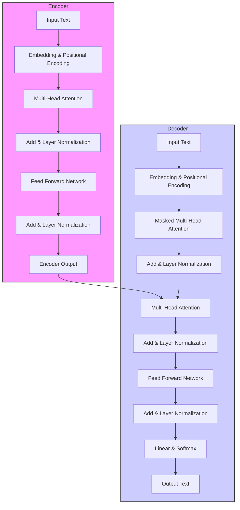

# TransformerモデルとLLM：基本原理解説

Transformerは、自然言語処理（NLP）の分野に革命をもたらし、大規模言語モデル（LLM）の基盤となっている非常に重要な技術です。この記事では、Transformerの基本原理から応用、そしてLLMとの関係まで、幅広く解説していきます。

**1. Transformerモデルとは？**

Transformerモデルは、2017年にGoogleの研究者たちによって発表された論文「Attention is All You Need」で提案されました。従来の自然言語処理モデル（例えばRNNやLSTM）とは大きく異なり、「**Attention機構**」という新しい仕組みを核としています。このAttention機構によって、Transformerは以下の点で優れています。

- **並列処理**: RNNのように sequential（逐次的）な処理ではなく、文中の単語を並列に処理できるため、計算効率が大幅に向上しました。
- **長距離依存関係の捉えやすさ**: 文中の離れた単語同士の関係性（長距離依存関係）を捉えるのが得意です。これにより、文脈をより深く理解できるようになりました。
- **高い性能**: 翻訳、文章生成、質問応答など、様々な自然言語処理タスクで、従来のモデルを大きく上回る性能を発揮しました。

Transformerの登場は、自然言語処理の分野におけるブレイクスルーとなり、その後のLLMの発展に大きく貢献しました。

**2. Transformerの基本原理：Attention機構**

Transformerの中核となるアイデアは、**Attention機構**です。Attention機構は、入力された文中の各単語が、他の単語とどれくらい関連しているか（注意を払うべきか）を計算する仕組みです。

**2.1 Self-Attention（自己注意）**

Transformerで最も重要なAttention機構が、**Self-Attention（自己注意）**です。Self-Attentionは、**入力文中の単語間の関連性を文脈全体から学習**します。

例えば、「猫が**魚**を**食べ**た」という文を考えてみましょう。Self-Attentionは、「魚」という単語に注目する際に、文中の他の単語（「猫」、「食べ」など）との関連性を考慮します。

- 「魚」と「猫」：食べる側と食べられる側の関係
- 「魚」と「食べ」：目的語と動詞の関係

このように、Self-Attentionは、文中の単語同士が互いにどのような影響を与え合っているかを捉え、文脈を理解するのに役立ちます。

**2.2 Attentionの計算方法**

Self-Attentionの計算は、以下のステップで行われます。

1. **Query (クエリ), Key (キー), Value (バリュー) の作成**: 入力された各単語を、それぞれQuery, Key, Valueという3つのベクトルに変換します。これらのベクトルは、学習によって獲得されます。
   - **Query**: 「質問」を表すベクトル。ある単語が他の単語に注意を払う際に使われます。
   - **Key**: 「検索キー」を表すベクトル。注意を払われる側の単語の情報を持っています。
   - **Value**: 「情報」を表すベクトル。実際に注意を払って取り出す情報です。

2. **Attention Score (注意スコア) の計算**: 各単語のQueryと、他のすべての単語のKeyとの類似度を計算します。この類似度がAttention Scoreとなり、どの単語にどれだけ注意を払うべきかを表します。類似度の計算には、内積などが用いられます。

3. **Softmax関数による正規化**: Attention ScoreをSoftmax関数に通すことで、合計が1になるように正規化します。これにより、Attention Scoreは確率分布となり、どの単語にどれだけ注意を払うべきかの割合が明確になります。

4. **Valueの重み付き和**: 正規化されたAttention Scoreを重みとして、Valueベクトルの重み付き和を計算します。これがSelf-Attentionの出力となり、文脈を考慮した単語の表現となります。

**数式による表現 (Self-Attention)**

Self-Attentionの計算は、数式で表すと以下のようになります。

```
Attention(Q, K, V) = softmax( (Q * K^T) / sqrt(d_k) ) * V
```

- **Q**: Query行列（各単語のQueryベクトルをまとめたもの）
- **K**: Key行列（各単語のKeyベクトルをまとめたもの）
- **V**: Value行列（各単語のValueベクトルをまとめたもの）
- **d_k**: Keyベクトルの次元数。スケーリングによって勾配消失を防ぎます。
- **Q \* K^T**: QueryとKeyの行列積。Attention Scoreを計算します。
- **softmax**: Softmax関数。Attention Scoreを正規化します。
- **V**: Value行列。正規化されたAttention Scoreに基づいて重み付き和を計算します。

**2.3 Multi-Head Attention (マルチヘッド注意)**

Transformerでは、Self-Attentionをさらに発展させた**Multi-Head Attention (マルチヘッド注意)** が用いられています。Multi-Head Attentionは、複数の異なる視点から単語間の関連性を捉えるために、Self-Attentionを並列に複数回行う仕組みです。

具体的には、

1. 入力されたQuery, Key, Valueを、**複数のヘッド**（例えば8個）に分割します。
2. 各ヘッドで独立にSelf-Attentionを計算します。
3. 各ヘッドの出力を結合し、線形変換することで、最終的な出力を得ます。

Multi-Head Attentionを用いることで、モデルはより多様な単語間の関係性を捉えることができ、性能向上が期待できます。

**3. Transformerの構成要素**

Transformerモデルは、主に**Encoder**（エンコーダ）と**Decoder**（デコーダ）という2つの部分から構成されています。



**図の説明:**

1. **Input Text (入力テキスト)**: 翻訳やテキスト生成などのタスクで入力されるテキストデータです。
2. **Embedding & Positional Encoding (埋め込みと位置エンコーディング)**:
   - **Embedding**: 入力テキスト中の単語をベクトル表現に変換します。
   - **Positional Encoding**: 単語の位置情報をベクトルとして付与し、モデルが単語の順序を認識できるようにします。
   - エンコーダとデコーダの両方で、入力テキスト（デコーダの場合はターゲットテキスト）に対して行われます。
3. **Encoder (エンコーダ)**: 入力テキストを内部表現（Encoder Output）に変換する役割を持ちます。
   - **Multi-Head Attention (マルチヘッド注意機構)**: 入力テキスト中の単語間の関連性を捉えます。複数の注意機構を並列に動作させることで、より多角的な関連性を学習します。
   - **Add & Layer Normalization (加算とレイヤー正規化)**: 残差接続 (Residual Connection) とレイヤー正規化 (Layer Normalization) を行います。
     - **Add**: Multi-Head Attention の出力と、その前の層への入力を足し合わせます（残差接続）。これにより、勾配消失問題を緩和し、深いネットワークの学習を容易にします。
     - **Layer Normalization**: 層内のニューロンの出力を正規化し、学習を安定化させます。
   - **Feed Forward Network (フィードフォワードネットワーク)**: 各単語のベクトル表現を、より高次元で複雑な表現に変換します。
   - 上記のMulti-Head Attention、Add & Layer Normalization、Feed Forward Network のブロックが複数回（通常は6回）繰り返されます。
4. **Decoder (デコーダ)**: エンコーダの出力（Encoder Output）と、自身が生成した出力に基づいて、次の単語を予測し、テキストを生成する役割を持ちます。
   - **Masked Multi-Head Attention (マスクドマルチヘッド注意機構)**: デコーダの自己注意機構です。未来の情報（まだ生成されていない単語）を参照しないようにマスクをかけます。これにより、デコーダは過去に生成した単語のみに基づいて次の単語を予測できます。
   - **Multi-Head Attention (マルチヘッド注意機構)**: エンコーダの出力（Encoder Output）と、デコーダのMasked Multi-Head Attention の出力を入力として、注意機構を計算します。これにより、デコーダは入力テキストのどこに注意を払うべきかを学習します。
   - **Add & Layer Normalization (加算とレイヤー正規化)**: エンコーダと同様に、残差接続とレイヤー正規化を行います。
   - **Feed Forward Network (フィードフォワードネットワーク)**: エンコーダと同様に、各単語のベクトル表現を変換します。
   - 上記のMasked Multi-Head Attention、Multi-Head Attention、Add & Layer Normalization、Feed Forward Network のブロックが複数回（通常は6回）繰り返されます。
5. **Linear & Softmax (線形層とソフトマックス関数)**:
   - **Linear**: デコーダの最終出力を、語彙数と同じ次元のベクトルに変換します。
   - **Softmax**: 線形層の出力を確率分布に変換します。各単語の生成確率を表し、最も確率の高い単語が最終的な出力単語として選択されます。
6. **Output Text (出力テキスト)**: 生成されたテキストデータです。

**3.1 Encoder（エンコーダ）**

Encoderは、**入力されたテキストデータをベクトル表現に変換する**役割を担います。TransformerのEncoderは、同じ構造を持つEncoderブロックを複数積み重ねたものです。各Encoderブロックは、主に以下の2つのサブ層から構成されています。

1. **Multi-Head Attention**: 入力テキスト中の単語間の関連性を学習します。
2. **Feed Forward Network (FFN)**: 各単語のベクトル表現を、より高次元で非線形な特徴空間に変換します。

各サブ層の後には、**Layer Normalization**（レイヤー正規化）と**Residual Connection**（残差接続）が適用されています。

- **Layer Normalization**: 各層の出力を正規化することで、学習を安定化させ、高速化します。
- **Residual Connection**: 入力とサブ層の出力を足し合わせることで、勾配消失を防ぎ、深いネットワークの学習を容易にします。

**Encoderブロックの処理の流れ**

1. **入力**: Encoderブロックへの入力は、前のEncoderブロックの出力、または入力埋め込み（最初のEncoderブロックの場合）です。
2. **Multi-Head Attention**: 入力をMulti-Head Attentionサブ層に入力し、文脈を考慮した単語の表現を得ます。
3. **Residual Connection & Layer Normalization**: Multi-Head Attentionの入力と出力を足し合わせ、Layer Normalizationを適用します。
4. **Feed Forward Network**: 正規化された出力をFeed Forward Networkサブ層に入力し、非線形変換を行います。
5. **Residual Connection & Layer Normalization**: Feed Forward Networkの入力と出力を足し合わせ、Layer Normalizationを適用します。
6. **出力**: 正規化された出力が、次のEncoderブロックへの入力、またはEncoderの最終出力となります。

TransformerのEncoderは、これらのEncoderブロックを通常6層程度積み重ねることで、入力テキストを深く理解し、文脈を捉えた高精度なベクトル表現を獲得します。

**3.2 Decoder（デコーダ）**

Decoderは、**Encoderによって生成されたベクトル表現（文脈情報）を用いて、テキストを生成する**役割を担います。例えば、翻訳タスクであれば、Encoderで入力言語の文をベクトル表現に変換し、Decoderでそのベクトル表現から目的言語の文を生成します。

TransformerのDecoderも、Encoderと同様に、同じ構造を持つDecoderブロックを複数積み重ねたものです。各Decoderブロックは、主に以下の3つのサブ層から構成されています。

1. **Masked Multi-Head Attention**: デコーダ自身が生成した単語列（自己回帰的な生成）に対してSelf-Attentionを適用します。ただし、未来の単語の情報は参照できないようにマスクされています。
2. **Encoder-Decoder Attention**: Encoderの出力（文脈情報）と、DecoderのMasked Multi-Head Attentionの出力を入力として、Attentionを計算します。これにより、デコーダは入力テキストの文脈情報を参照しながらテキストを生成できます。
3. **Feed Forward Network (FFN)**: 各単語のベクトル表現を、より高次元で非線形な特徴空間に変換します。

各サブ層の後には、Encoderと同様に、Layer NormalizationとResidual Connectionが適用されています。

**Decoderブロックの処理の流れ**

1. **入力**: Decoderブロックへの入力は、前のDecoderブロックの出力、または出力埋め込み（最初のDecoderブロックの場合）です。
2. **Masked Multi-Head Attention**: 入力をMasked Multi-Head Attentionサブ層に入力し、自己回帰的な文脈を考慮した表現を得ます。
3. **Residual Connection & Layer Normalization**: Masked Multi-Head Attentionの入力と出力を足し合わせ、Layer Normalizationを適用します。
4. **Encoder-Decoder Attention**: 正規化された出力とEncoderの出力をEncoder-Decoder Attentionサブ層に入力し、入力テキストの文脈情報を考慮した表現を得ます。
5. **Residual Connection & Layer Normalization**: Encoder-Decoder Attentionの入力と出力を足し合わせ、Layer Normalizationを適用します。
6. **Feed Forward Network**: 正規化された出力をFeed Forward Networkサブ層に入力し、非線形変換を行います。
7. **Residual Connection & Layer Normalization**: Feed Forward Networkの入力と出力を足し合わせ、Layer Normalizationを適用します。
8. **出力**: 正規化された出力が、次のDecoderブロックへの入力、またはDecoderの最終出力となります。

TransformerのDecoderは、これらのDecoderブロックを通常6層程度積み重ねることで、Encoderから受け取った文脈情報を基に、自然で流暢なテキストを生成します。

**3.3 Positional Encoding（位置エンコーディング）**

Transformerは、RNNのような再帰的な構造を持たないため、単語の**位置情報**を明示的にモデルに与える必要があります。そのために用いられるのが、**Positional Encoding（位置エンコーディング）**です。

Positional Encodingは、単語の位置に応じて異なるベクトルを生成し、単語の埋め込みベクトルに加算します。これにより、モデルは文中の単語の位置関係を認識できるようになります。

Positional Encodingには、正弦関数と余弦関数を用いたものが一般的です。位置 `pos`、次元 `i` のPositional Encodingの値 `PE(pos, i)` は、以下の式で計算されます。

```
PE(pos, 2i)   = sin(pos / 10000^(2i/d_model))
PE(pos, 2i+1) = cos(pos / 10000^(2i/d_model))
```

- `pos`: 単語の位置 (0, 1, 2, ...)
- `i`: ベクトルの次元のインデックス (0, 1, 2, ..., d_model/2 - 1)
- `d_model`: 埋め込みベクトルの次元数

Positional Encodingによって、Transformerは単語の順序を考慮した処理が可能になり、自然言語の文法構造を捉えることができるようになります。

**4. Transformerの学習**

Transformerモデルは、大量のテキストデータを用いて**教師あり学習**で学習されます。学習の主な目的は、モデルが自然言語の文法や意味構造を捉え、様々な自然言語処理タスクを高い精度で実行できるようにすることです。

Transformerの学習は、大きく分けて**事前学習**（Pre-training）と**ファインチューニング**（Fine-tuning）の2段階で行われることが一般的です。

**4.1 事前学習（Pre-training）**

事前学習は、**大量のラベルなしテキストデータ**を用いて、Transformerモデルのパラメータを初期化する段階です。事前学習によって、モデルは一般的な言語知識や文脈理解能力を獲得します。

代表的な事前学習タスクとしては、以下のようなものがあります。

- **Masked Language Model (MLM)**: 入力文の一部の単語をマスク（隠蔽）し、マスクされた単語を予測するタスクです。BERTなどで用いられています。
- **Next Sentence Prediction (NSP)**: 2つの文が与えられたとき、2番目の文が1番目の文の続きかどうかを予測するタスクです。BERTで用いられていましたが、最近の研究ではNSPの効果は疑問視されています。
- **Causal Language Modeling (CLM)**: 文脈となる単語列が与えられたとき、次の単語を予測するタスクです。GPTなどで用いられています。

これらの事前学習タスクを通じて、Transformerモデルは単語の意味、文法、文脈、そして世界に関する知識などを学習します。事前学習済みのモデルは、様々な自然言語処理タスクの**汎用的な基盤モデル**として利用できます。

**4.2 ファインチューニング（Fine-tuning）**

ファインチューニングは、**特定のタスクに特化したラベル付きデータ**を用いて、事前学習済みモデルのパラメータをさらに調整する段階です。例えば、翻訳タスクであれば、翻訳された文のペアのデータセットを用いて、翻訳精度を高めるようにモデルを学習します。

ファインチューニングによって、事前学習で獲得した汎用的な言語知識を、特定のタスクに最適化することができます。これにより、各タスクで高い性能を発揮できるようになります。

ファインチューニングの対象となるタスクは多岐にわたります。

- **テキスト分類**: 文書のカテゴリを分類するタスク（例：感情分析、スパム検出）
- **質問応答**: 質問文に対して適切な回答文を生成するタスク
- **機械翻訳**: ある言語の文を別の言語の文に翻訳するタスク
- **テキスト要約**: 長い文書を短い要約文にまとめるタスク
- **対話**: 人間と自然な対話を行うタスク

Transformerモデルは、事前学習とファインチューニングという2段階の学習プロセスを経ることで、様々な自然言語処理タスクで高い性能を発揮することができます。

**5. Transformerの応用：LLM（大規模言語モデル）**

Transformerモデルは、**LLM（大規模言語モデル）** の基盤技術として、その発展に大きく貢献しました。LLMとは、Transformerモデルを**非常に大規模なデータセット**で**大規模に学習**させたモデルのことです。

LLMは、以下のような特徴を持ち、従来の自然言語処理モデルとは一線を画す性能を発揮します。

- **驚異的な文章生成能力**: 人間が書いた文章と区別がつかないほど、自然で流暢な文章を生成できます。
- **高度な文脈理解能力**: 長い文脈や複雑な文構造を理解し、文脈に沿った適切な応答や処理ができます。
- **汎用的なタスク遂行能力**: テキスト生成、翻訳、質問応答、要約、対話など、多岐にわたる自然言語処理タスクを高い精度でこなすことができます。
- **知識の活用**: 事前学習で獲得した膨大な知識を活用し、質問応答などで知識に基づいた回答を生成できます。
- **Few-shot/Zero-shot Learning**: わずかな例や例なしで、新しいタスクに適応できる能力（in-context learning）を持つモデルも登場しています。

**代表的なLLMの例**

- **GPTシリーズ (GPT-3, GPT-4など)**: OpenAIによって開発されたLLM。文章生成能力に優れており、様々なテキスト生成タスクで高い性能を発揮します。
- **BERT (Bidirectional Encoder Representations from Transformers)**: Googleによって開発されたLLM。文脈を双方向から捉えるTransformer Encoderを基盤としており、テキスト分類や固有表現抽出などのタスクで高い性能を発揮します。
- **RoBERTa (A Robustly Optimized BERT Approach)**: BERTを改良したモデル。学習方法の改善やデータ量の増加により、BERTよりも高い性能を実現しています。
- **T5 (Text-to-Text Transfer Transformer)**: Googleによって開発されたLLM。全ての自然言語処理タスクを「テキストからテキストへの変換」として統一的に扱うことを目指したモデル。
- **LaMDA (Language Model for Dialogue Applications)**, **Bard**: Googleによって開発された対話に特化したLLM。
- **PaLM (Pathways Language Model)**: Googleによって開発された大規模LLM。高い性能と多様な能力を持つとされています。
- **LLaMA (Large Language Model Meta AI)**: Meta AI (Facebook) によって開発されたLLM。オープンソースで公開されており、研究や開発に広く利用されています。

これらのLLMは、Transformerモデルのアーキテクチャを基盤とし、大規模なデータと計算資源を投入して学習されています。LLMの登場により、自然言語処理技術は新たな段階に入り、様々な分野での応用が期待されています。

**LLMの応用例**

LLMは、その高い自然言語処理能力を活かして、様々な分野で応用されています。

- **文章生成**: ブログ記事、小説、詩、脚本、メール、レポートなど、様々な種類の文章を自動生成
- **翻訳**: 高精度な機械翻訳、多言語対応のチャットボット
- **質問応答**: FAQシステム、顧客サポート、検索エンジンの高度化
- **対話**: 自然な対話を行うチャットボット、バーチャルアシスタント
- **テキスト要約**: ニュース記事の要約、論文の要約、議事録の要約
- **コンテンツ作成支援**: アイデア出し、文章校正、文章改善
- **プログラミング支援**: コード生成、コード補完、バグ検出
- **教育**: 個別最適化された学習コンテンツの生成、学習支援
- **医療**: 医療記録の分析、診断支援、患者とのコミュニケーション支援

LLMの応用範囲は非常に広く、今後さらに拡大していくと予想されます。

**6. Transformerの発展と課題**

Transformerモデルは、自然言語処理分野に大きな進歩をもたらしましたが、まだ発展途上の技術であり、いくつかの課題も抱えています。

**Transformerの発展**

- **効率化**: Transformerの計算コスト、特にSelf-Attentionの計算量は入力系列長の二乗に比例するため、長い文章の処理には計算資源と時間がかかります。近年では、Attention機構の効率化、モデルの軽量化、分散学習技術の開発など、Transformerの効率化に関する研究が盛んに行われています。
  - **Sparse Attention**: Attentionの計算を一部の単語ペアに限定することで、計算量を削減する手法
  - **蒸留 (Distillation)**: 大規模なTransformerモデルの知識を、より軽量なモデルに継承する手法
  - **量子化 (Quantization)**, **剪定 (Pruning)**: モデルのパラメータ数を削減し、軽量化する手法

- **高性能化**: より大規模なデータセットや計算資源を用いた学習、モデルアーキテクチャの改良、事前学習タスクの工夫など、Transformerの性能向上に関する研究も活発に進められています。
  - **Transformer XL**: 長い文脈を扱えるようにTransformerを拡張したモデル
  - **Big Bird**: 長い系列長に対応可能なSparse Attention機構を導入したモデル
  - **Switch Transformer**: 条件付き計算（Conditional Computation）を導入し、モデルサイズを大幅に拡大したモデル

- **新たな応用分野の開拓**: 自然言語処理だけでなく、画像認識、音声処理、時系列データ分析、グラフデータ分析など、Transformerを様々な分野に応用する研究が進められています。
  - **Vision Transformer (ViT)**: 画像認識タスクにTransformerを適用したモデル
  - **Audio Spectrogram Transformer (AST)**: 音声認識タスクにTransformerを適用したモデル

**Transformerの課題**

- **計算コストとメモリ消費**: 大規模なTransformerモデルは、学習や推論に大量の計算資源とメモリを必要とします。
- **解釈可能性の低さ**: Transformerは非常に複雑なモデルであり、モデルの内部動作や意思決定の根拠を理解することが難しい場合があります（ブラックボックス性）。
- **学習データの偏り**: 学習データに偏りがある場合、モデルが社会的な偏見や不公平性を学習してしまう可能性があります。
- **長文脈の処理**: Transformerは長距離依存関係を捉えるのが得意ですが、非常に長い文脈（数千単語以上）を効率的に処理するのは依然として課題です。
- **Continuous Learning/Lifelong Learning**: Transformerモデルは、新しい知識を継続的に学習したり、環境変化に適応したりする能力（継続学習/生涯学習）がまだ限定的です。

これらの課題を克服し、Transformerモデルをさらに発展させるための研究が、現在も世界中で精力的に行われています。

**7. まとめ**

Transformerモデルは、Attention機構を核とする革新的な自然言語処理モデルであり、LLMの基盤技術として、自然言語処理分野に大きな進歩をもたらしました。Transformerの登場により、機械翻訳、文章生成、質問応答、対話など、様々な自然言語処理タスクの性能が飛躍的に向上し、LLMという形で、その応用範囲は急速に拡大しています。

Transformerはまだ発展途上の技術であり、計算効率、解釈可能性、倫理的な問題など、多くの課題も抱えています。しかし、Transformerとその周辺技術の研究開発は非常に活発であり、これらの課題を克服し、より高性能で、より人間社会に役立つ自然言語処理技術が実現されることが期待されます。

Transformerモデルは、自然言語処理、そしてAI技術全体において、今後も中心的な役割を果たし続けるでしょう。Transformerの原理を理解し、その進化を追い続けることは、これからの情報社会において非常に重要です。

この記事が、Transformerモデルについて理解を深めるための一助となれば幸いです。さらに深く学びたい場合は、以下のキーワードで検索したり、関連論文を読んでみてください。

- Attention機構 (Attention Mechanism)
- Self-Attention (自己注意)
- Multi-Head Attention (マルチヘッド注意)
- Transformer (変形器)
- Encoder-Decoderモデル
- Positional Encoding (位置エンコーディング)
- 事前学習 (Pre-training)
- ファインチューニング (Fine-tuning)
- 大規模言語モデル (LLM: Large Language Model)
- BERT, GPT, RoBERTa, T5, etc.

これからもTransformer技術の進化に注目していきましょう！

---

[Top](/) | https://x.com/yukiosak1

<script src="drive-md.js"></script>
