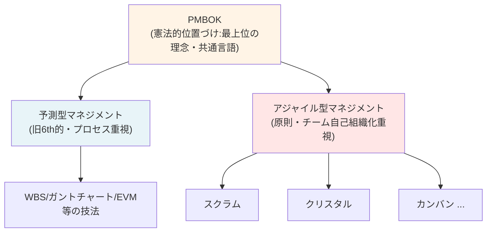
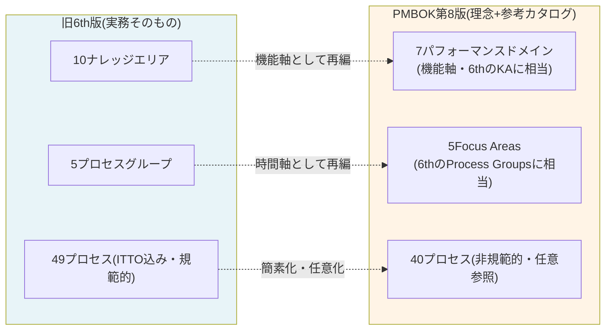
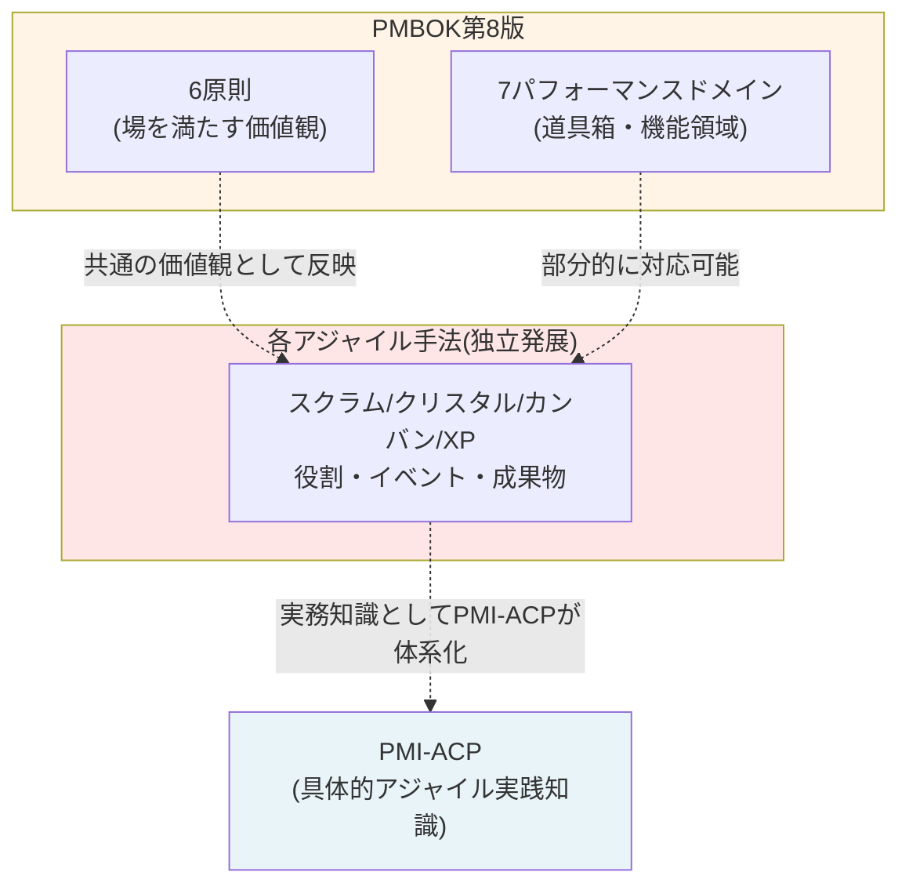

## 1. PMBOKの位置づけ(全体像)

**要点**
- PMBOKはどの方法論にも肩入れせず、共通する原則・機能領域を抽出した「憲法」的立ち位置
- 個々の方法論(WBS的手法、スクラム等)は「個別法」に相当し、現場はこちらを直接参照する
- PMBOKは日常業務のマニュアルではなく、**組織横断・方法論横断で会話するための共通の物差し**

---

## 2. 旧6th方式(予測型マネジメント)とPMBOKのマッピング

### 位置づけ

旧6th版は「プロセス」という具体的手順書そのものだった。第7版でPMBOKはこの実務層を一度手放し、第8版で「非規範的プロセス」として部分的に復活させたが、あくまで**参考カタログ**としての位置づけであり、6th版のような強制力・具体性は持たない。

### 詳細マッピング

| 旧6th版の要素 | PMBOK第8版での対応 | 位置づけの変化 |
|---|---|---|
| 10ナレッジエリア | 7パフォーマンスドメイン | ほぼ同じ機能軸だが数を整理・統合 |
| 5プロセスグループ | 5 Focus Areas | 名称変更のみ、概念はほぼ同一 |
| 49プロセス(規範的・必須手順) | 40プロセス(非規範的・テーラリング前提) | **「必ずやる手順」から「必要なら使う選択肢」へ性格が根本転換** |
| ITTO(Input/Tool&Technique/Output)を暗記する体系 | Inputs and Outputs / Tools and Techniques(参照カタログ) | 暗記対象から参照辞書へ |
| WBS、ガントチャート、EVM等の実務技法 | 各パフォーマンスドメイン内で言及されるが、詳細手順は現場のツール・実務書に委ねる | PMBOKは「何を使うか」を示すが「どう使うか」の深掘りはしない |

**実務での使われ方**
- 建設・製造・大規模インフラなど、計画重視・変更コストが高いプロジェクトでは、旧6th的な考え方(WBS、EVM、変更管理プロセス)は今も現場で使われる
- ただし現場が参照するのは6th版の実務知識そのもの、または各種プロジェクト管理ツール(MS Project等)のノウハウであり、PMBOK第8版を都度開くわけではない
- PMBOK第8版は、こうした予測型プロジェクトが「他の方法論とどう接続するか」を語る際の共通言語として機能

---

## 3. アジャイル方式(スクラム、クリスタル、カンバン等)とPMBOKのマッピング

### 位置づけ

アジャイル手法群は、そもそも「プロセスに従って計画を実行する」という思想を持たない。**不確実性を管理対象ではなく前提として受け入れ、チームの自己組織化と適応力で対応する**という別の哲学に立つ。PMBOKの原則層(第7版で導入)は、この思想を後追いで取り込む形で生まれた。

### 詳細マッピング

| アジャイル手法の要素 | PMBOK第8版での対応 | 補足 |
|---|---|---|
| スクラムの役割(PO/SM/開発チーム) | Resources / Stakeholdersドメインに部分的に対応 | PMBOKは役割を規定せず、機能(誰が何を管理するか)のみ言及 |
| スプリント(反復サイクル) | 「短いライフサイクルの反復」概念、開発アプローチ(Adaptive)の記述 | PMBOKは反復の存在は認めるが、スプリント運営の具体作法(タイムボックス等)は規定しない |
| プロダクトバックログ | Scopeドメイン | 概念は対応するが、バックログ運用のノウハウはスクラムガイド側の専売特許 |
| Definition of Done | Embed Quality原則 | 原則レベルでは重なるが、具体的な運用はPMBOKの範囲外 |
| クリスタルのチーム規模別プロセス選択 | Tailoring(第8版第3章) | 「プロジェクトの文脈に応じて調整する」という思想は共通 |
| カンバンのWIP制限・フロー最適化 | 対応する明確な概念なし | PMBOKにはフロー効率という考え方自体が薄く、カンバンはPMBOKの外側で独自発展した体系 |
| 自己組織化チーム | Build an Empowered Culture原則 | 第8版で明確に原則化された数少ない直接対応 |
| ふりかえり(レトロスペクティブ) | 明確な対応なし(Lessons Learnedに近いが弱い) | PMBOKの継続的改善概念は薄く、各手法側が主導 |

**実務での使われ方**
- スクラム、クリスタル、カンバンいずれも、それぞれの原典(スクラムガイド、クリスタル関連書籍、カンバン実践書)を直接参照するのが実務の基本
- PMI-ACPは、これらアジャイル手法群を横断的にまとめた資格であり、PMBOKよりも実務との距離が近い
- PMBOK第8版はアジャイル手法を規定・代替するものではなく、**予測型プロジェクトと同じ土俵で語るための共通言語(原則・機能ドメイン)を提供するだけ**

---

## 4. 全体まとめ

| 観点 | 旧6th的マネジメント | アジャイル(スクラム等) |
|---|---|---|
| 対応する哲学 | 計画→統制、不確実性を減らす | 検知→適応、不確実性を前提とする |
| PMBOKとの距離 | プロセス層(40プロセス)で部分的に接続 | 原則層(6原則)で部分的に接続 |
| 実務で直接参照するもの | 6th版実務知識、各種PMツール | スクラムガイド、クリスタル、カンバン等の原典 |
| PMI資格との対応 | PMP(旧来寄りの内容も含む) | PMI-ACP |
| PMBOKの役割 | 「憲法」として、両者が異なる哲学を持ちながらも同じ土俵(原則・パフォーマンスドメイン)で語れるようにする共通言語 |

**結論**
PMBOKは実務そのものを規定するガイドではなく、**予測型・アジャイル型という異なる哲学を持つ方法論群が、組織内で共通言語として会話するための最上位フレームワーク**という位置づけが最も実態に近い。現場チームが日常的に参照するのは、それぞれの具体的方法論(6th版実務知識、スクラムガイド等)であり、PMBOKはPMOレベル・組織横断のガバナンスレベルで参照される性格が強い。
